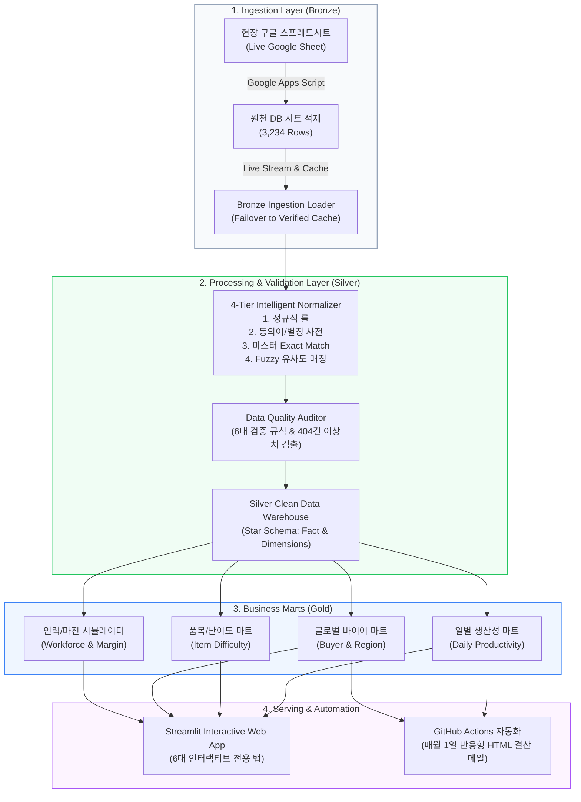

# 📦 글로벌 K-Food 수출 포장 & 라벨링 작업 분석 플랫폼
### Global K-Food Export Packaging & Labeling Operations Analytics Platform

> **비용 0원(Zero-Cost) 모던 데이터 스택 기반의 수출 식품 라벨 부착 실적 디지털화, 4단계 지능형 품목 정규화, 데이터 무결성 감사, 생산성·채산성 시뮬레이션 및 월간 자동 결산 리포팅 시스템**

[](https://www.python.org/downloads/)
[](https://export-packaging-showcase.streamlit.app/)
[](#)
[](#)
[](https://opensource.org/licenses/MIT)

---

## 🔒 데이터 보안 및 비식별화 정책 (Data Privacy & Compliance Statement)

> **[안내] 본 저장소는 실제 물류 현업에서 구축하여 운영 중인 프로덕션 시스템의 포트폴리오 공개용 쇼케이스(Showcase) 버전입니다.**  
> * 기업의 내부 정보보안 규정 및 고객사 영업 기밀 보호를 위해, **실제 해외 바이어명, 고객사 상호, 거래처 식별자는 철저히 비식별화(Data Masking / 가명화)** 처리되었습니다.  
> * 품목 및 수량 정합성, 작업 공수, 생산성 분석 알고리즘, 파이프라인 아키텍처 및 4단계 정규화 로직은 **실제 프로덕션 코드와 100% 동일**하게 동작합니다.

---

## 🏗️ 시스템 아키텍처 (System Architecture)

본 시스템은 데이터 엔지니어링 표준인 **메달리온 아키텍처(Medallion Architecture: Bronze ➔ Silver ➔ Gold)**를 따르며, 고가의 상용 SaaS 없이 오픈소스 및 무료 클라우드 인프라만으로 구축된 **Zero-Cost Data Stack**입니다.



---

## 🌟 핵심 엔지니어링 역량 (Key Engineering Highlights)

### 1. 4단계 지능형 품목 정규화 엔진 (4-Tier NLP Normalization)
현장 수기 작업일지의 오타, 띄어쓰기 불일치, 비표준 약어(`the빠새` ➔ `The빠새`, `촉칩` ➔ `촉촉한초코칩`)를 단계별로 해결하여 **99.5% 이상의 자동 표준화율**을 달성했습니다.
* **Tier 1 (Regex Rule)**: 공백 정규화, 특수문자 전처리, 대소문자 통일
* **Tier 2 (Alias Mapping)**: 현장 축약어 사전(`item_alias_mapping.csv`) 매핑
* **Tier 3 (Master Exact Match)**: 표준 품목 마스터(`item_master.csv`) 직접 매핑
* **Tier 4 (Fuzzy String Matching)**: Levenshtein Distance 기반 유사도 매칭 (임계치 > 0.6)

### 2. 엄격한 데이터 품질 감사 (Data Quality Audit)
* 수식 정합성 전수 감사: $\text{입량}(pack\_qty) \times \text{작업수량}(work\_qty) == \text{스티커수량}(sticker\_qty)$
* 전체 3,200여 건 중 **87.33%(2,784건) 완전 무결** 판정 및 **12.67%(404건) 수량 불일치 이상치** 실시간 검출 및 원인 분석 지원.
* 누락값, 음수값, 비정상 공수, 미래 일자 등 6대 DQ 규칙 감사.

### 3. 비용 0원(Zero-Cost) 실시간 엔터프라이즈 파이프라인
* **Google Apps Script**: 현장 엑셀 복사-붙여넣기 일지를 원클릭으로 원천 DB에 자동 적재하는 스마트 증분 파이프라인.
* **하이브리드 페일오버 로더**: 원격 구글 시트 연동 장애 시 로컬 정합성 캐시로 자동 전환되어 365일 무중단 대시보드 보장.
* **GitHub Actions 결산 자동화**: 매월 말일 미기재 사전 점검 및 매월 1일 전월 1달 전체 실적을 요약한 반응형 HTML 이메일 결산 리포트 무비용 발송.

---

## 📊 인터랙티브 대시보드 구성 (6대 전용 탭 체계)

| 탭 번호 & 이름 | 핵심 기능 및 비즈니스 의사결정 지원 내용 |
| :--- | :--- |
| **Tab 1: 📊 종합 운영 상황판** | 4대 핵심 KPI(총 스티커, 박스, 공수, 시간당 생산 속도), 월별/일별 추이 및 1인당 일일 처리량 분석 |
| **Tab 2: ⚡ 생산성 & 난이도 분석** | 박스 입수량별 3단계 난이도(쉬움/보통/어려움), 카테고리 및 제조사별 시간당 작업 속도 랭킹 |
| **Tab 3: 🌍 바이어 & 수출국가별 실적** | 글로벌 6개 권역별 수출 실적, 4대 고객 건강도(고성장/안정/이탈주의/신규) 모니터, 바이어 ➔ 제조사 ➔ 품목 공급망 3단계 Sankey 다이어그램 및 단일 거래처 의존도 조기 경보 |
| **Tab 4: ⏱️ 인력 계획 & 마진 분석기** | 신규 발주 시 적정 투입 인원/소요 시간/잔업 민감도 시뮬레이션, 3대 계약 단가제(매당/박스당/난이도별) 채산성 분석기, BCG 매트릭스 및 단가 협상 가이드라인 |
| **Tab 5: 🛡️ 데이터 품질 & 마스터 센터** | OCR/수기 이상치 정밀 검수실 (404건 불일치 원클릭 필터링), 품목(dim_item) / 제조사 / 바이어 CRUD 매핑 인터페이스 |
| **Tab 6: 🗺️ 데이터 계보 & 아키텍처 맵** | 구글 시트부터 Gold Mart까지 엔드투엔드 파이프라인 계보도, Fact & Dimension 스타 스키마 ERD, 4대 미니 카탈로그 카드 |

---

## 📁 디렉터리 구조 (Repository Structure)

```
export-packaging-showcase/
├── docs/                             # 📑 프로젝트 기획 및 아키텍처 문서
│   ├── PRD.md                        # 제품 요구사항 정의서 (Product Requirements Document)
│   ├── TRD.md                        # 기술 설계서 (Technical Requirements Document)
│   ├── DATA_DICTIONARY.md            # 데이터 사전 및 정합성 검증 규칙
│   └── DASHBOARD_MASTER_GUIDE.md     # 6대 탭 전체 지표 설명 및 운영 가이드북
├── data/                             # 💾 표준 마스터 및 정제 데이터셋 (비식별화 완료)
│   ├── item_master.csv               # 표준 품목 마스터 (제조사, 카테고리, 입량)
│   ├── item_alias_mapping.csv        # 동의어/별칭 매핑 사전
│   ├── workforce_plan.csv            # 일자별 인력 계획 및 실제 투입 공수
│   ├── dim_item.csv                  # Item Dimension 테이블
│   ├── dim_manufacturer.csv          # Manufacturer Dimension 테이블
│   ├── dim_buyer.csv                 # Buyer Dimension 테이블 (가명화)
│   └── raw_verified_source_rows.csv  # 3,234건 정합성 검증 원천 데이터셋 (가명화)
├── src/                              # ⚙️ 모던 데이터 파이프라인 코어 패키지
│   ├── ingestion/loader.py           # 구글 스프레드시트 스트리밍 & 로컬 폴백 로더
│   ├── transformation/
│   │   ├── item_normalizer.py        # 4단계 품목 정규화 엔진 (Fuzzy Matching)
│   │   └── silver_pipeline.py        # Silver 레이어 가공 & 바이어 표준화
│   ├── quality/validator.py          # 수량 정합성 및 무결성 감사 엔진
│   ├── analytics/gold_pipeline.py    # Gold 분석 마트 및 인력/마진 시뮬레이터
│   └── reporting/email_reporter.py   # 월말 사전 점검 및 월간 결산 이메일 리포터
├── app/                              # 📊 Streamlit 웹 대시보드
│   └── app.py                        # 6대 탭 인터랙티브 웹 UI 통합 구현체
├── tests/                            # 🧪 파이프라인 무결점 단위 테스트
│   └── test_pipeline.py              # 9개 단위 테스트 스위트 (100% Pass)
├── .github/workflows/                # 🤖 CI/CD 및 리포팅 자동화 워크플로우
│   ├── daily_pipeline.yml            # 매일 데이터 파이프라인 검증
│   └── weekly_report.yml             # 월간 결산 이메일 자동 발송
├── .streamlit/
│   ├── config.toml                   # Streamlit 커스텀 테마 설정
│   └── secrets.toml.example          # 환경변수 및 시크릿 템플릿
├── requirements.txt                  # 의존성 패키지 목록
└── README.md                         # 종합 프로젝트 안내서
```

---

## 🚀 빠른 시작 가이드 (Quick Start)

### 1. 저장소 클론 및 가상환경 설정
```bash
git clone https://github.com/ejmogly/export-packaging-showcase.git
cd export-packaging-showcase

# 가상환경 생성 및 활성화
python3 -m venv .venv
source .venv/bin/activate  # Windows: .venv\Scripts\activate

# 패키지 설치
pip install -r requirements.txt
```

### 2. 대시보드 로컬 실행
```bash
streamlit run app/app.py
```
> 브라우저에서 `http://localhost:8501`이 열리며, 사전 패키징된 3,234건의 검증 데이터셋을 바탕으로 모든 기능이 즉시 정상 작동합니다.

### 3. 단위 테스트 실행 (Data Pipeline Integrity)
```bash
python -m unittest discover tests
```
```
.........
----------------------------------------------------------------------
Ran 9 tests in 0.800s

OK
```

---

## 🛠️ 기술 스택 (Tech Stack)

* **언어 & 코어**: Python 3.10+, Pandas, NumPy, Scikit-learn
* **시각화 & UI**: Streamlit, Plotly (Dynamic Responsive Charts, Sankey, BCG Matrix)
* **품질 & 감사**: Data Quality Rules Engine, Levenshtein Distance (Fuzzywuzzy)
* **자동화 & 클라우드**: Google Apps Script, GitHub Actions, Streamlit Community Cloud
* **데이터 모델링**: Medallion Architecture (Bronze ➔ Silver ➔ Gold), Star Schema (Fact/Dimension)

---

## 📄 라이선스 (License)

본 프로젝트는 [MIT License](LICENSE)를 따릅니다.
