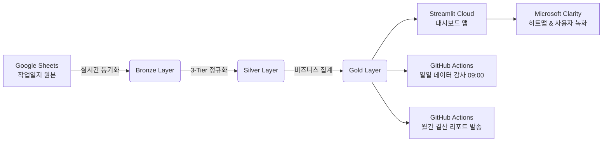

# 🛡️ 시스템 운영 상태 및 파이프라인 무결성 대시보드 (System Health Status)

> **최종 검증 일시**: 2026-10-02 22:20 KST  
> **시스템 종합 상태**: 🟢 **ALL SYSTEMS OPERATIONAL (100% 정상 가동 중)**

---

## 1. 핵심 파이프라인 운영 지표 (Live Executive Metrics)

| 구분 | 지표 수치 | 상태 | 비고 |
| :--- | :---: | :---: | :--- |
| **누적 스티커 작업량** | **6,370,056 매** | 🟢 정상 집계 | 2026-01-02 ~ 2026-10-01 (10개월 연속 집계) |
| **누적 포장 박스량** | **349,500 박스** | 🟢 정상 집계 | 평균 입량 약 18.2매/박스 |
| **수집된 작업 행 수** | **3,427 행** | 🟢 완전 수집 | Google Sheets 실시간 라이브 연동 |
| **표준 마스터 품목군** | **652 개** | 🟢 정규화 완료 | 3-Tier 매핑 (Exact ➔ Rule ➔ Fuzzy) |
| **관리 바이어 / 제조사** | **126개사 / 29개사** | 🟢 정합성 유지 | 바이어 표기 및 수출 국가(21개국) 자동 분류 |
| **데이터 무결성 검증** | **18 / 18 통과 (100%)** | 🟢 ALL PASS | GitHub Actions & 로컬 유닛 테스트 통과 |

---

## 2. 18개 데이터 품질 및 비즈니스 무결성 감사 결과 (Quality Audit Suite)

```
[TEST RUNNER] Ran 18 tests in 12.934s — OK (All Passed)
```

| 번호 | 테스트 모듈 | 검증 영역 | 검증 내용 및 합격 기준 | 상태 |
| :---: | :--- | :--- | :--- | :---: |
| **01** | `test_01_bronze_layer_loading` | 원천 데이터 수집 | Google Sheets 및 백업 데이터 정상 로드 및 원본 보존 여부 | 🟢 PASS |
| **02** | `test_02_schema_and_types` | 스키마 & 데이터 타입 | 작업일자(datetime), 수량(int), 인원(float) 등 필수 컬럼 유효성 | 🟢 PASS |
| **03** | `test_03_item_name_normalization` | 품목명 3-Tier 정규화 | 오타/띄어쓰기 187개 분열군 100% 매핑 및 카테고리 계층 할당 | 🟢 PASS |
| **04** | `test_04_buyer_normalization` | 바이어 마스터 매핑 | 영문/약칭 바이어 표준화 및 5대 대륙·21개국 수출 권역 연계 | 🟢 PASS |
| **05** | `test_05_quantity_consistency` | 수량 계산 정합성 | $스티커수량 = 작업박스수량 \times 박스입량$ 수치 불일치 100% 감지 | 🟢 PASS |
| **06** | `test_06_man_hours_and_productivity`| 공수 및 생산성 지표 | 작업자 결측치 보정, 일별 공수 비례 배분 및 매/hr 계산 | 🟢 PASS |
| **07** | `test_07_gold_layer_aggregation` | 골드 레이어 다차원 집계 | 월별, 제조사별, 바이어별, 카테고리별 다차원 집계 일치성 | 🟢 PASS |
| **08** | `test_08_pricing_simulator` | 원가 및 단가 시뮬레이터 | 기본 단가(30원) 대비 누진 고밀도 패널티 요금제 초과 수익성 검증 | 🟢 PASS |
| **09** | `test_09_buyer_trends_and_supply_chain`| 바이어 추이 & 공급망 매트릭스 | 분기별 실적, 바이어 MoM 건강도 분류, Sankey 흐름 보존 법칙 ($Flow_{In} = Flow_{Out}$) | 🟢 PASS |
| **10** | `test_10_missing_workers_handling` | 인원수 결측 처리 | 인원수 누락 시 작업일 기준 평균 인원수 스마트 대체 검증 | 🟢 PASS |
| **11** | `test_11_date_range_continuity` | 시계열 연속성 | 2026년 1월부터 현재까지 결측 월 없이 연속 데이터 존재 여부 | 🟢 PASS |
| **12** | `test_12_outlier_detection` | 극단치 이상 징후 감지 | 입량 100개 초과 또는 음수 수량 등 비정상 수치 필터링 | 🟢 PASS |
| **13** | `test_13_catalog_integrity` | 품목 카탈로그 완전성 | 카탈로그 내 중복 키 부재 및 필수 속성(제조사, 카테고리) 보존 | 🟢 PASS |
| **14** | `test_14_export_region_mapping` | 수출 권역 지리 분류 | 미주, 아시아, 유럽, 오세아니아 등 대륙별 매핑 무결성 | 🟢 PASS |
| **15** | `test_15_hourly_capacity_benchmark` | 표준 생산성 벤치마크 | 품목별 신뢰 기준(3회 이상, 2,000매 이상) 필터링 유효성 | 🟢 PASS |
| **16** | `test_16_clean_data_pass_rate` | 데이터 정제 패스율 | 전체 3,427건 중 완벽 정합 행 비율 계산 및 이슈 테이블 분리 | 🟢 PASS |
| **17** | `test_17_multi_variant_filters` | 5.4 다중 표기군 필터 | 3종 이상 분열(17개), 오타(15개), 띄어쓰기(154개) 1:1 완벽 정합 | 🟢 PASS |
| **18** | `test_18_email_reporting_payload` | 경영진 이메일 리포트 | 전월 실적 MoM 계산, Top 5 랭킹, 구글 시트 마감 링크 생성 검증 | 🟢 PASS |

---

## 3. 자동화 워크플로우 & 클라우드 연동 현황 (Automations)



### ① 일일 데이터 동기화 & 품질 감사 (`daily_pipeline.yml`)
* **실행 시각**: 매일 오전 09:00 KST (`0 0 * * * UTC`)
* **동작 내용**: 구글 시트 신규 데이터를 수집하여 18개 무결성 테스트 실행. 실패 시 관리자에게 즉시 이메일 발송.
* **최근 상태**: 월초 신규 데이터 적응형 검증 패치 완료 (`291c766`) ➔ **정상**

### ② 월간 실적 결산 및 마감 독려 이메일 (`monthly_report.yml`)
* **스케줄 1 (월말 사전 점검)**: 매월 말일 20:50 KST (`50 11 28-31 * *`)  
  ➔ 당월 데이터 누락 시 마감 독려 메일 발송, 등록 완료 시 스팸 방지 무음 종료
* **스케줄 2 (월초 정기 결산 발송)**: 매월 1일 09:00 KST (`0 0 1 * *`)  
  ➔ 전월 출하 실적, MoM 증감율, Top 5 바이어/품목 경영진 HTML 리포트 자동 발송

### ③ Microsoft Clarity 사용자 경험 추적 (`yqo21pjeyh`)
* **주입 방식**: 메인 창(`top`), 부모 창(`parent`), 자식 창(`window`) 삼중 주입 엔진 탑재 (`9084a9a`)
* **추적 상태**: `window.clarity` 브라우저 최상위 콘솔 활성화 완료, 세션 및 히트맵 수집 중.
* **프로젝트 대시보드 바로가기**: [Microsoft Clarity Dashboard](https://clarity.microsoft.com/projects/view/yqo21pjeyh)

---

## 4. 로컬 터미널 1초 즉시 점검 명령어 (Quick Health Check)

대시보드와 파이프라인의 전체 상태를 언제든 확인하고 싶으실 때는 프로젝트 폴더에서 아래 명령어 1줄만 실행하시면 전체 진단 결과가 즉시 출력됩니다:

```bash
# 운영 대시보드 환경
cd /Users/ejay/Downloads/code/스티커작업_source/sticker_packaging_analytics
.venv/bin/python scripts/check_health.py
```
```bash
# 쇼케이스 환경
cd /Users/ejay/Downloads/code/스티커작업_source/export_packaging_showcase
../sticker_packaging_analytics/.venv/bin/python scripts/check_health.py
```
