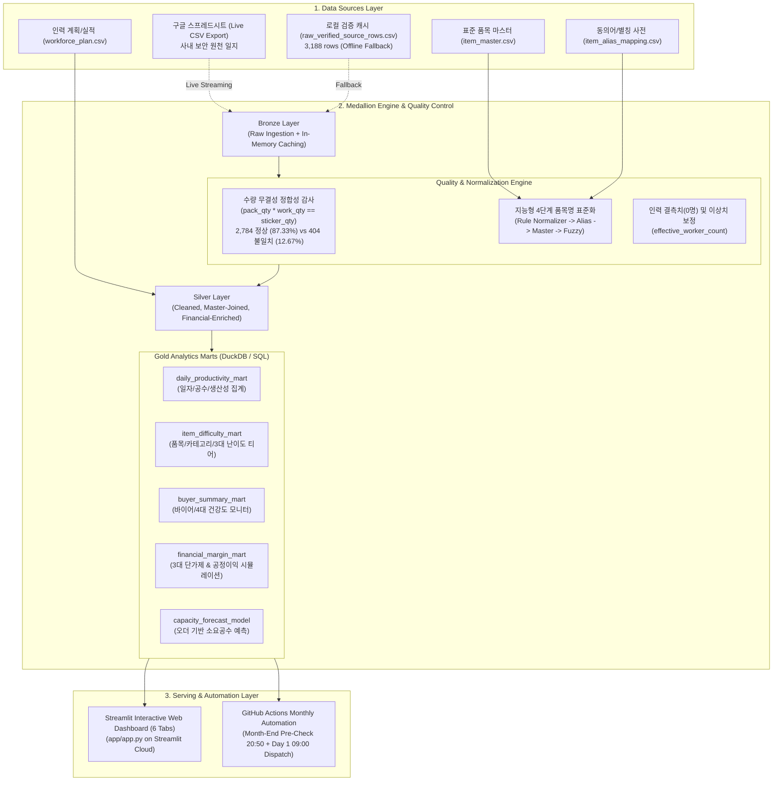

# 🛠️ Technical Requirements Document (TRD) & System Design

## 1. 시스템 아키텍처 개요 (System Architecture)

본 시스템은 **"구글 스프레드시트(Live Ingestion) → Medallion 데이터 파이프라인(Bronze-Silver-Gold) → DuckDB/Pandas 분석 엔진 → Streamlit 6대 전용 대시보드 & GitHub Actions 월간 결산 자동화"**로 구성되는 100% 무비용(Zero-Cost) 경량 고성능 모던 데이터 플랫폼입니다.



---

## 2. 데이터 계층 및 스키마 명세 (Data Layers & Schemas)

### 2.1 Bronze Layer (`bronze_sticker_work_log`)
* **목적**: 구글 시트 원천 데이터를 결측이나 변형 없이 그대로 수집 (Raw Ingestion).
* **물리 저장소**: 로컬 캐시 `data/raw_verified_source_rows.csv` 및 메모리 버퍼.
* **스키마**:
  | 컬럼명 | 원천 타입 | 설명 | 비고 |
  | :--- | :--- | :--- | :--- |
  | `source_file_name` | string | 원천 파일명 (TalkFile_20260X... 등) | 수기 일지 식별자 |
  | `page_no` | int | 일지 페이지 번호 | $1 \le \text{page} \le 100$ |
  | `work_month` | string | 작업 연월 (`YYYY-MM`) | 파티셔닝 기준 |
  | `work_date` | string | 작업 일자 (`YYYY-MM-DD`) | 타임스탬프 |
  | `worker_count` | float/int | 투입 작업자 수 | 0인 경우 결측치 |
  | `line_no` | int | 일지 내 순번 | 일자별 고유 순번 |
  | `item_name` | string | 수기 입력 제품명 | 오타/약어 존재 |
  | `volume` | string | 규격/용량 (예: 60, 250x6, 1.5 등) | 단위 비표준 |
  | `pack_qty` | int | 박스당 입수량 | $\ge 1$ |
  | `work_qty` | int | 작업 박스 수 | $\ge 1$ |
  | `sticker_qty` | int | 부착 스티커 수량 | 원천 기재 수량 |
  | `remark` | string | 비고/거래처/수출국가/오더번호 | 바이어 정보 혼재 |
  | `is_verified` | bool | 1차 검수 여부 | 불일치 여부 판단 |
  | `verified_note` | string | 검수 특이사항 메모 | 수량 보정 내역 등 |

---

### 2.2 Silver Layer (`silver_sticker_work_log`)
* **목적**: 결측치 보정, 수량 정합성 플래그 부여, 품목 마스터(`item_master`) 조인, 바이어/국가 정규화 및 난이도 티어가 결합된 고신뢰 Fact 데이터.
* **스키마 추가/변환 컬럼**:
  | 컬럼명 | 변환 타입 | 로직 및 설명 |
  | :--- | :--- | :--- |
  | `normalized_item_name` | string | 텍스트 정규화 및 별칭 사전 적용된 표준 제품명 |
  | `manufacturer` | string | 제조사 (`item_master` 조인: 롯데웰푸드, 오리온, 해태제과 등) |
  | `category_1` | string | 대분류 (과자, 음료, 냉동식품, 주류 등) |
  | `category_2` | string | 중분류 (스낵, 비스킷/쿠키, 초콜릿, 탄산음료 등) |
  | `buyer_normalized` | string | 비고/거래처 정규화 (예: '판아시아 오스트리아', '희창물산' 등) |
  | `export_country` | string | 정규화된 수출 대상국 (예: 오스트리아, 캐나다, 독일, 미국 등) |
  | `calc_sticker_qty` | int | `pack_qty * work_qty` 계산값 |
  | `qty_mismatch_flag` | bool | `calc_sticker_qty != sticker_qty` 시 `True` (404건 감지) |
  | `unmatched_item_flag` | bool | 마스터 매핑 실패 시 `True` (현재 0건) |
  | `difficulty_tier` | string | 입수량 기준 3단계 난이도 (`쉬움`: $\le 12$, `보통`: $13 \sim 30$, `어려움`: $\ge 31$) |
  | `effective_worker_count` | float | 0명 누락 시 인력 계획 및 전후일 이동평균 기반 보정 인원 |
  | `total_worker_hours` | float | 일자별 $\text{effective\_worker\_count} \times 8.0 + \text{overtime\_hours}$ |

---

### 2.3 Gold Layer (Analytics Data Marts)

#### Mart 1. 일자별 생산성 마트 (`daily_productivity_mart`)
* **단위(Grain)**: `work_date` (일별 1행)
* **주요 지표**:
  * `total_stickers`: 일일 총 부착 스티커 수량 ($\sum \text{sticker\_qty}$)
  * `total_boxes`: 일일 총 작업 박스 수량 ($\sum \text{work\_qty}$)
  * `worker_count`: 당일 투입 인원
  * `total_worker_hours`: 당일 총 투입 공수 (Man-Hours)
  * `stickers_per_man_hour`: $\frac{\text{total\_stickers}}{\text{total\_worker\_hours}}$ (시간당 부착 스티커 수)
  * `boxes_per_man_hour`: $\frac{\text{total\_boxes}}{\text{total\_worker\_hours}}$ (시간당 박스 작업 수)
  * `stickers_per_worker_daily`: $\frac{\text{total\_stickers}}{\text{effective\_worker\_count}}$ (1인당 일일 처리량)

#### Mart 2. 품목/카테고리별 난이도 마트 (`item_difficulty_mart`)
* **단위(Grain)**: `normalized_item_name`
* **주요 지표**:
  * `total_work_orders`: 총 작업 횟수 (건수)
  * `total_boxes`: 누적 작업 박스 수
  * `total_stickers`: 누적 부착 스티커 수
  * `avg_pack_qty`: 평균 박스당 입수량
  * `difficulty_tier`: 3단계 난이도 등급 (`쉬움`, `보통`, `어려움`)

#### Mart 3. 바이어/수출국가별 실적 마트 (`buyer_summary_mart`)
* **단위(Grain)**: `buyer_normalized`
* **주요 지표**:
  * `order_count`: 주문 건수
  * `total_stickers`: 총 스티커 부착량 및 전체 대비 점유율(%)
  * `total_boxes`: 총 박스 수량
  * `buyer_health_status`: MoM/QoQ 발주 변동 기반 4대 건강도 상태 (`🚀 고성장`, `🟢 안정/유지`, `⚠️ 이탈 주의`, `🆕 신규/재개`)

#### Mart 4. 재무 마진 채산성 마트 (`financial_margin_mart`)
* **단위(Grain)**: `normalized_item_name` 또는 `buyer_normalized`
* **주요 지표**:
  * `total_revenue`: 계약 단가제에 따른 총 매출 (원)
  * `labor_cost`: 투입 공수 × 시급 (기본 13,000원) 기반 인건비 (원)
  * `gross_profit`: $\text{total\_revenue} - \text{labor\_cost}$ (공정 이익)
  * `margin_rate`: $\frac{\text{gross\_profit}}{\text{total\_revenue}} \times 100$ (마진율 %)
  * `margin_per_box`: $\frac{\text{gross\_profit}}{\text{total\_boxes}}$ (박스당 마진 원)

---

## 3. 핵심 엔진 상세 설계

### 3.1 지능형 4단계 품목 표준화 엔진 (`item_normalizer.py`)
```python
def normalize_item_name(raw_name: str, alias_dict: dict, master_df: pd.DataFrame):
    # 1단계: 텍스트 룰 정규화 (공백, 괄호, 특수기호 제거 및 소문자화)
    clean_name = re.sub(r'[\s\(\)_-]+', '', raw_name).lower()
    
    # 2단계: 동의어/별칭 사전 매핑 (item_alias_mapping.csv)
    if raw_name in alias_dict:
        return alias_dict[raw_name], 1.0, False
    
    # 3단계: 품목 마스터 Exact Match (item_master.csv)
    if raw_name in master_df['제품명'].values:
        return raw_name, 1.0, False
        
    # 4단계: Fuzzy Matching (SequenceMatcher)
    matches = difflib.get_close_matches(raw_name, master_df['제품명'].values, n=1, cutoff=0.7)
    if matches:
        score = difflib.SequenceMatcher(None, raw_name, matches[0]).ratio()
        return matches[0], score, True
        
    return raw_name, 0.0, True  # Unmatched 경고
```

### 3.2 임가공 단가 & 재무 마진 채산성 분석 모델 (Pricing & Margin Financial Model)
* **목적**: 작업자 시급(기본 13,000원/시간)과 계약 단가 체계를 실시간 연동하여 오더/바이어/품목별 매출총이익 및 마진율 시뮬레이션.
* **계약 단가 책정 방식 (3가지 옵션)**:
  1. **스티커 1매당 단가제 (Flat per Sticker)**:  
     $$\text{Revenue} = \text{sticker\_qty} \times P_{\text{sticker}} \quad (\text{기본값: 15원/매})$$
  2. **박스 1박스당 단가제 (Flat per Box)**:  
     $$\text{Revenue} = \text{work\_qty} \times P_{\text{box}} \quad (\text{기본값: 350원/박스})$$
  3. **난이도/입수량 연동 차등 단가제 (Tiered by Pack Density)**:  
     $$\text{Revenue} = \sum (\text{sticker\_qty}_i \times P_{\text{tier}(i)})$$  
     * 쉬움($\le 12$개): 12원/매 | 보통($13 \sim 30$개): 16원/매 | 어려움($\ge 31$개): 22원/매
* **재무 채산성 핵심 수식**:
  $$\text{Labor Cost} = \sum (\text{row\_man\_hours} \times \text{hourly\_wage})$$
  $$\text{Gross Profit} = \text{Revenue} - \text{Labor Cost}$$
  $$\text{Gross Margin (\%)} = \frac{\text{Gross Profit}}{\text{Revenue}} \times 100$$
  $$\text{Margin per Box} = \frac{\text{Gross Profit}}{\text{Total Boxes}}$$

---

## 4. 프론트엔드 대시보드 구조 (`app/app.py`)

* **기술 스택**: Streamlit, Plotly Express/Graph Objects, Pandas, DuckDB.
* **화면 구성 (6대 전용 탭 체계)**:
  1. **헤더 & 글로벌 사이드바**:
     * 실시간 동기화 버튼(`Cache Clear & Rerun`).
     * 분석 기간 필터(전체, 당월, 전월, 직접 지정).
     * 제조사 및 바이어 멀티셀렉트 필터.
  2. **Tab 1: 📊 종합 운영 상황판 (Executive Control Tower)**:
     * 4대 메인 KPI 카드: 총 스티커, 총 박스, 총 공수, 시간당 생산 속도.
     * 중앙 차트: 일별 스티커 작업량 추이 및 1인당 일일 처리량(호버 툴팁).
     * 제조사별/바이어별 점유율 및 일자별 상세 집계 테이블.
  3. **Tab 2: ⚡ 생산성 & 난이도 분석 (Productivity Deep-Dive)**:
     * 3대 난이도 티어 카드 (쉬움/보통/어려움).
     * 카테고리/제조사별 시간당 작업 속도 랭킹.
     * 품목별 평균 입수량 및 작업 속도 산점도/박스플롯.
  4. **Tab 3: 🌍 바이어 & 수출국가별 실적 분석 (3대 서브탭)**:
     * **서브탭 3.1: 📊 종합 실적**: 권역/국가별 출하량 및 바이어 상세 마트.
     * **서브탭 3.2: 📈 발주 추이 & 고객 건강도 모니터**: Top 6 바이어 누적 발주 추이 적층 바 차트(단일 호버 툴팁 순위 정렬) 및 4대 고객 건강도(🚀고성장, 🟢안정, ⚠️이탈주의, 🆕신규) 스코어카드.
     * **서브탭 3.3: 🔗 공급망 교차 매트릭스**: 바이어 ➔ 제조사 ➔ 품목 3단계 생키(Sankey) 다이어그램 및 70% 이상 단일 거래처 의존도 조기 경보.
  5. **Tab 4: ⏱️ 인력 계획 & 마진 채산성 분석기 (2대 서브탭)**:
     * **서브탭 4.1: ⏱️ 인력 계획 & 납기 시뮬레이터**: 신규 오더 입력 시 벤치마크 기반 필요 공수, 적정 투입 인원, 잔업 시간 및 납기 민감도 곡선.
     * **서브탭 4.2: 💰 임가공 단가 & 마진 채산성 분석기**: 시급(기본 13,000원) 및 3대 계약 단가제 시뮬레이터, 재무 4대 KPI, 바이어별 흑자/적자 랭킹, 품목별 BCG 매트릭스 및 단가 협상 가이드라인.
  6. **Tab 5: 🛡️ 데이터 품질(DQ) & 마스터 관리(MDM) 센터 (4대 서브탭)**:
     * **서브탭 5.1: 🔍 OCR/수기 이상치 정밀 검수실**: 87.33% 무결성 통과 2,784건 vs 404건 불일치 데이터 전수 필터링 및 원인 분석.
     * **서브탭 5.2: 🏷️ 품목 마스터 & 별칭 관리**: 실시간 별칭 등록 및 신규 SKU 마스터 추가.
     * **서브탭 5.3: 🏭 제조사 마스터 관리**: 제조사별 품목 수 및 신규 제조사 CRUD.
     * **서브탭 5.4: 🚢 바이어 마스터 관리**: 거래처별 수출국가 매핑 및 신규 바이어 CRUD.
  7. **Tab 6: 🗺️ 데이터 계보 & 아키텍처 맵 (3대 서브탭)**:
     * **서브탭 6.1: 🗺️ 데이터 파이프라인 계보도**: 원천 구글 시트부터 Gold Mart까지 인터랙티브 Graphviz 흐름도.
     * **서브탭 6.2: 🧩 Fact & Dimension 관계도**: 팩트 테이블과 3대 디멘전 간 1:N 스타 스키마 ERD.
     * **서브탭 6.3: 📋 통합 데이터 카탈로그**: 4대 미니 개요 카드(행 수, 컬럼 수, 갱신 주기, 보존 정책) 및 스키마 탐색기.

---

## 5. CI/CD 및 자동화 파이프라인 (`.github/workflows/`)

### 5.1 `daily_pipeline.yml` (일일 데이터 검증 파이프라인)
* **트리거**: 매일 00:00 UTC (09:00 KST) + `workflow_dispatch` 수동 실행.
* **작업 내용**:
  1. 최신 구글 시트 데이터 로드 및 정합성 검증.
  2. 9대 유닛 테스트(`tests/test_pipeline.py`) 자동 실행 (품목 정규화, 수량 검증, 마트 집계 등).
  3. 테스트 통과 시에만 배포 브랜치 무결성 유지.

### 5.2 `weekly_report.yml` (월말 사전 점검 및 월간 결산 자동화)
* **트리거**:
  * 크론 스케줄 1: `50 11 28-31 * *` (매월 말일 20:50 KST) - 월말 사전 점검.
  * 크론 스케줄 2: `0 0 1 * *` (매월 1일 09:00 KST) - 월간 결산 리포트 정기 발송.
  * 수동 트리거: `workflow_dispatch` (비상/테스트 즉시 구동).
* **작업 내용**:
  * **사전 점검(Pre-Check)**: 당월 작업 일지가 구글 시트에 비어있을 경우 `⚠️ [마감 사전 독려 알림]` 발송.
  * **정기 결산(Closing Report)**: 전월 1달 전체 누적 실적 집계 → MoM 지표, Top 5 품목/바이어, 4대 DQ 감사 결과가 포함된 반응형 HTML 이메일 전사 발송.

